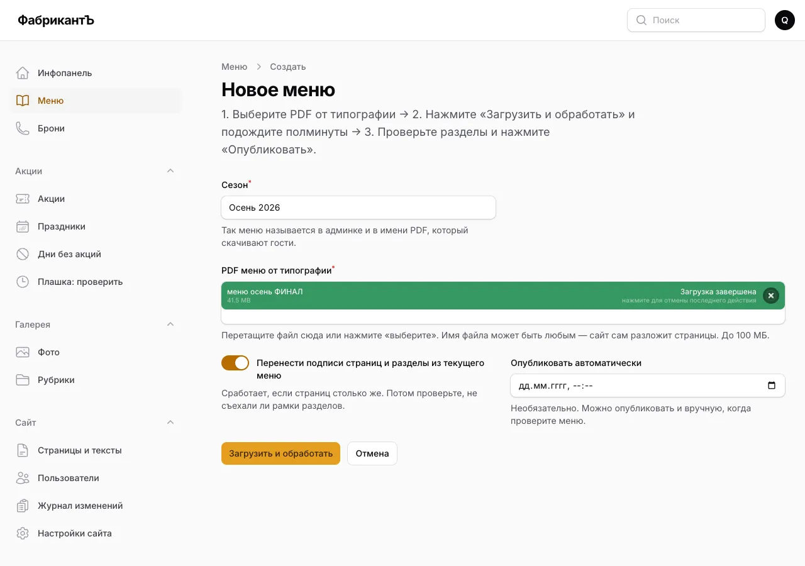
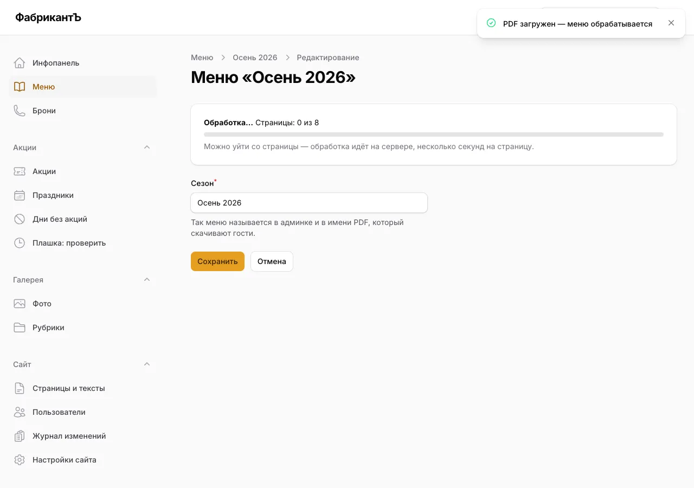
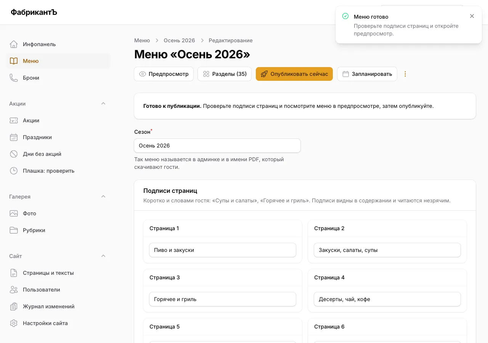
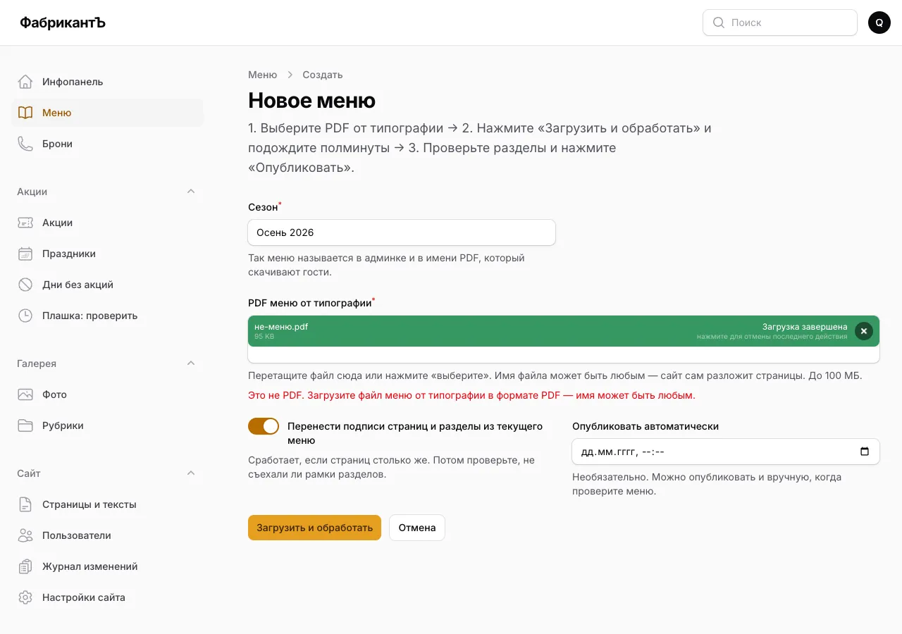
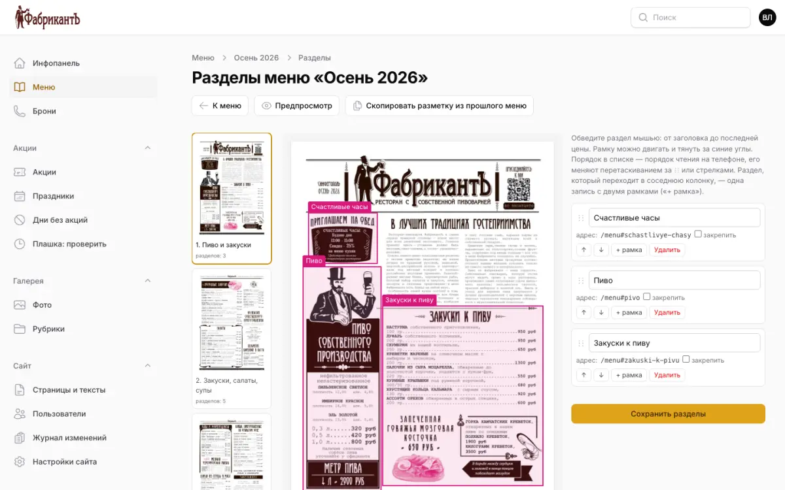
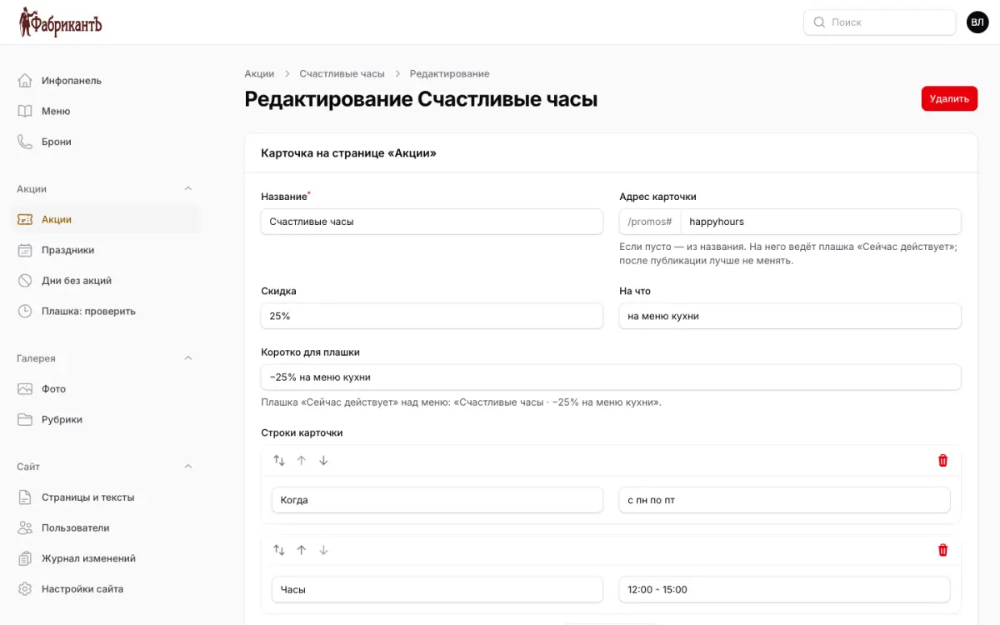
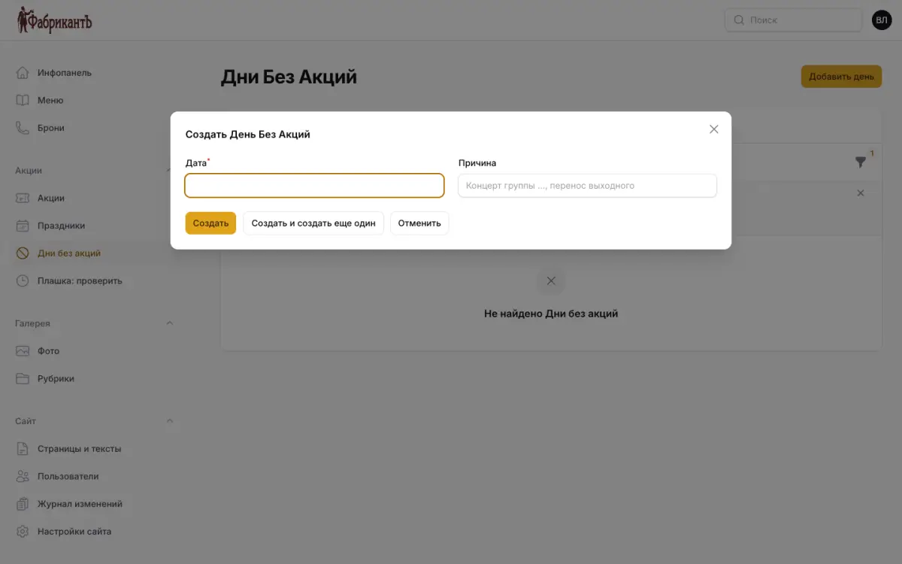
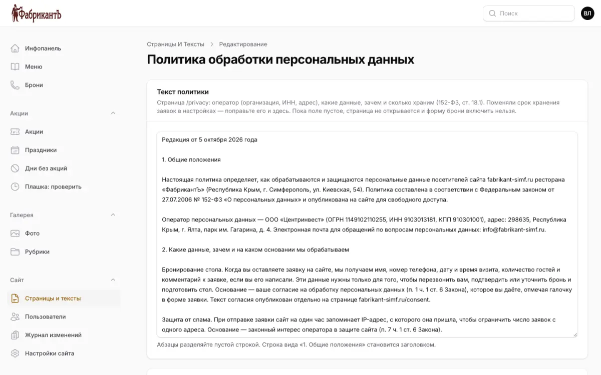
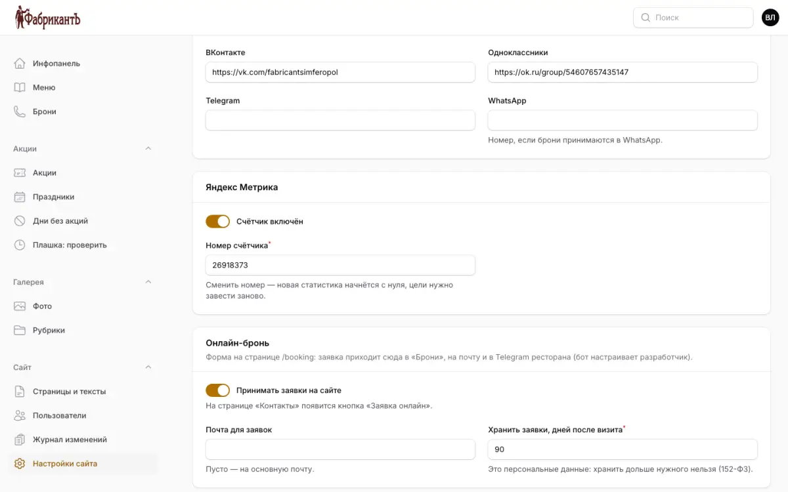
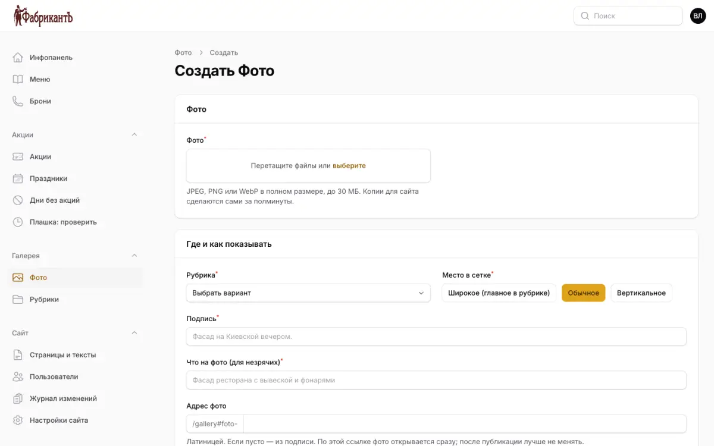

# Админка сайта: инструкция для ресторана

Вход: `https://fabrikant-simf.ru/admin`, по почте и паролю. Забыли пароль — ссылка «Забыли пароль?» на странице входа.

## Как обновить меню

Нужен только PDF от типографии. Имя файла может быть любым («меню осень ФИНАЛ», «menu_v3.pdf» — неважно):
сайт сам проверит, что это PDF, и разложит его по страницам.

1. Слева **«Меню»** → вверху справа **«Загрузить новое меню»**.
2. **Сезон** подставится сам («Осень 2026») — поправьте, если нужно.
3. Перетащите PDF в поле **«PDF меню от типографии»** (или нажмите «выберите») и дождитесь зелёной плашки
   «Загрузка завершена». Переключатель «Перенести подписи страниц и разделы» оставьте включённым —
   если страниц столько же, разметка разделов перейдёт из прошлого меню.
4. Нажмите **«Загрузить и обработать»**.

   

5. Откроется карточка меню с полосой прогресса. Обработка занимает около полминуты; со страницы можно уйти.

   

6. Когда появится **«Готово к публикации»**:
   - проверьте подписи страниц («Супы и салаты», «Горячее и гриль») и нажмите «Сохранить»;
   - **«Разделы»** — пролистайте страницы и поправьте рамки, если они съехали;
   - **«Предпросмотр»** — так меню увидят гости (ссылку можно переслать на телефон).

   

7. **«Опубликовать сейчас»** — гости сразу видят новое меню, прежнее уходит в архив.
   Или **«Запланировать»** — опубликуется само в выбранное время.

Передумали — в списке меню кнопка **«Откатить на прошлое меню»**.

### Если что-то пошло не так

- **«Это не PDF»** — выбран не тот файл (картинка, документ Word). Нужен PDF от типографии.

  

- **«PDF защищён паролем»** — попросите типографию прислать файл без пароля.
- **«Не получилось обработать меню»** — нажмите «Повторить обработку»; не помогло — напишите разработчику.

## Как поправить разделы меню

Разделы — это кадры, которые гость видит на телефоне («Супы», «Пиво»), и адреса для QR-кодов (`/menu#supy`).
Если число страниц в новом меню то же, разделы переносятся сами — проверьте, не съехали ли рамки.

1. **«Меню»** → нужное меню → **«Разделы»**.
2. Слева — страницы меню, посередине — лист с рамками, справа — список разделов.
3. Рамку можно двигать мышью и тянуть за синие углы. Новый раздел — обведите мышью от заголовка до последней
   цены. Раздел в двух колонках — одна запись с двумя рамками («+ рамка»).
4. Порядок в списке — порядок на телефоне: перетаскивайте за точки слева или стрелками.
5. **«Сохранить разделы»**. **«Предпросмотр»** покажет, как это увидит гость.

Адрес раздела (`/menu#supy`) печатают на QR-кодах. Если переименовать раздел, сайт спросит, оставить старый
адрес или сменить — **оставляйте старый**, если QR уже напечатаны. Галочка «закрепить» не даёт адресу
меняться никогда.

## Как изменить акцию

1. **«Акции»** → нужная акция.
2. Вверху — карточка на странице «Акции»: название, скидка, на что, строки «Когда / Часы», условия.
   «Коротко для плашки» — текст плашки «Сейчас действует» над меню.
3. Ниже — **расписание**: дни недели, часы (или «весь день»), «не действует в праздники», период акции.
   Без расписания акция есть только на странице «Акции», плашку не показывает.
4. Фото — JPEG или PNG, сайт сам обрежет кадр 4:3.
5. **«Сохранить»**. Проверить, что увидит гость в любой день и час, — **«Плашка: проверить»**.

## Концерт или перенос выходного: день без акций

В дни концертов «Счастливые часы» не действуют. Чтобы плашка в этот день не обещала скидку:

1. **«Дни без акций»** → **«Добавить день»**.
2. Дата и причина («Концерт группы …», «перенос выходного») → **«Создать»**.

Официальные праздники РФ уже в разделе **«Праздники»** — кнопка «Добавить официальные праздники РФ»
дописывает недостающие на новый год.

## Тексты страниц и политика

**«Страницы и тексты»** → страница. У каждой — заголовок и описание для поиска, картинка для ссылок в
мессенджерах и тексты блоков («О ресторане», «Контакты», 404). Пустое поле — на сайте текст по умолчанию.

**«Политика обработки персональных данных»** — два текста: сама политика (`/privacy`) и отдельное согласие
(`/consent`), на них ведёт галочка в форме брони. Абзацы разделяйте пустой строкой; строка вида
«1. Общие положения» становится заголовком. Поменяли реквизиты или срок хранения заявок — поправьте и здесь.

## Онлайн-бронь

**«Настройки сайта»** → блок **«Онлайн-бронь»** → **«Принимать заявки на сайте»**. На «Контактах» появится кнопка
«Заявка онлайн». Заявки приходят в **«Брони»**, на почту (поле «Почта для заявок», пусто — на основную) и в
Telegram ресторана — там только дата, время и число гостей, имя и телефон смотрите в «Бронях».
Включить можно, только если заполнены политика и согласие.

В **«Бронях»** перезвоните гостю и отметьте «Подтвердить» / «Отклонить» / «Гость пришёл». Старые заявки сайт
удаляет сам через указанное число дней после визита — это персональные данные, дольше хранить нельзя.

## Как добавить фото в галерею

1. **«Галерея» → «Фото»** → **«Создать»**.
2. Перетащите фото в полном размере (JPEG, PNG или WebP до 30 МБ) — копии для сайта сделаются за полминуты.
3. Рубрика, место в сетке (широкое — главное в рубрике, обычное, вертикальное), подпись и «что на фото» для
   незрячих — коротко и по делу («Фасад ресторана с вывеской и фонарями»).
4. **«Создать»**. Порядок в рубрике меняется перетаскиванием в списке фото.

## Остальные разделы

- **Брони** — заявки с сайта: перезвоните гостю и отметьте «Подтвердить» / «Отклонить» / «Гость пришёл».
- **Акции** — карточки акций и расписание плашки «Сейчас действует»; **«Плашка: проверить»** показывает, что увидит
  гость в любой день и час. **Праздники** и **Дни без акций** — когда акции «не в праздники» не действуют.
- **Галерея** → **Фото** / **Рубрики** — загрузка фото, подписи, порядок перетаскиванием.
- **Страницы и тексты** — тексты «О ресторане», «Контакты», заголовки для поиска.
- **Настройки сайта** — телефон, адрес, часы работы, соцсети, онлайн-бронь (только владелец).
- **Пользователи** и **Журнал изменений** — только владелец.
